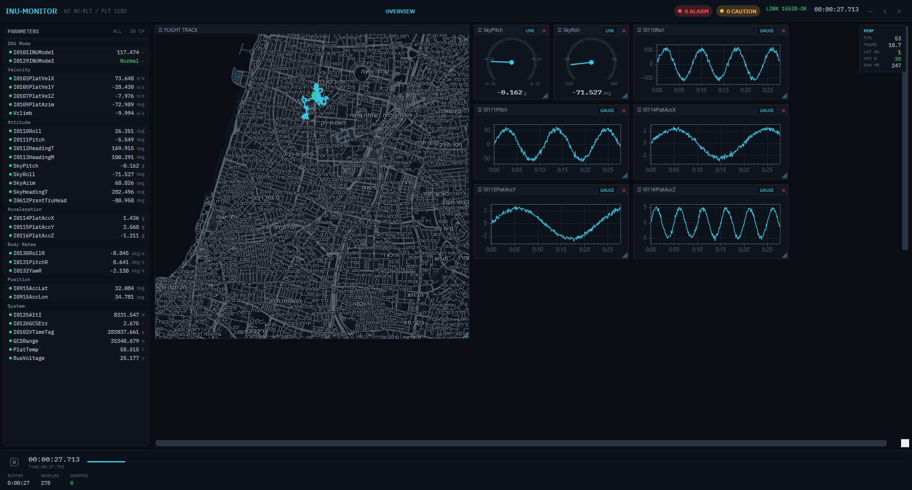
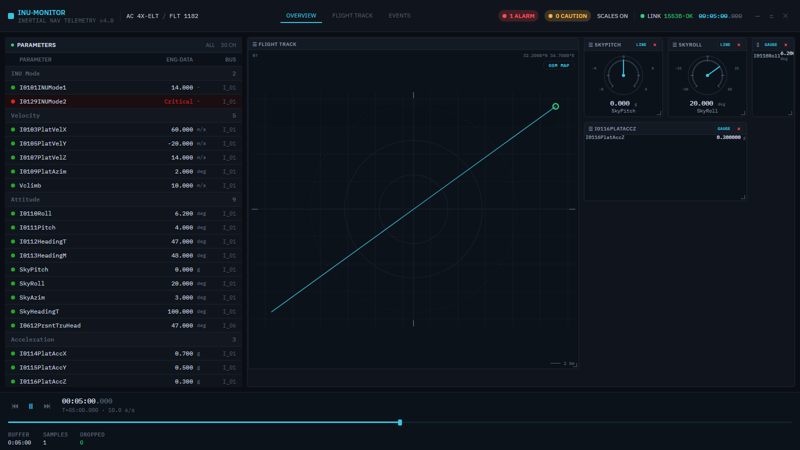

# wpf-rust-compare-charts

Render the **same realtime telemetry dashboard in two stacks** and compare their performance.

An INU-style monitoring dashboard — live parameter table, scrolling strip charts, radial gauges, GPS map, and a perf HUD — is replayed from a shared SQLite "ride" and built twice:

| | Rust app | .NET app |
|---|---|---|
| Stack | Tauri 2 + React + TypeScript | **Avalonia UI** (AXAML, MVVM, C#) — cross-platform |
| Charts | uPlot (scrolling time-series) | ScottPlot.Avalonia |
| Map | MapLibre GL — **offline** vector basemap | native MVT/Skia renderer — **offline** MBTiles |
| Transport | local WebSocket | in-process |

This is a **paradigm contrast**: a web WebView UI (Tauri/React) vs a native retained-mode UI (Avalonia) — each stack in its own idiom. Both read the **same `ride.db`** and show the same HUD — FPS, frame time, end-to-end latency, CPU% (per-core), RAM — so the two stacks can be compared head to head. Target layout: [`docs/reference/dashboard-target.md`](docs/reference/dashboard-target.md).

> The .NET app was originally WPF + Blazor Hybrid, reskinned to native WPF/XAML, then **ported from WPF to Avalonia UI** (in place — only the shell project changed; the four inner architecture rings were untouched). It now runs natively on **Linux, Windows, and macOS** (verified on a Kali Linux VM), and targets **.NET 10 LTS**.

> **Benchmark note:** the .NET app now renders through **Skia** (Avalonia's backend), so the comparison is **Avalonia-Skia vs Rust-Skia** — it was WPF-DirectX vs Rust before the port. Keep this in mind when reading the HUD/footprint numbers.

## Screenshots

**.NET — Avalonia UI** (offline MVT/Skia map)



**Rust — Tauri + React** (uPlot charts, MapLibre map)



## Measured footprint

Both apps replaying the same ride at `RIDE_SPEED=1.0` with the full dashboard + offline map (**1:1** — both render the live MVT basemap), **Release** builds. Sampled after a 30 s warm‑up over a 6 s window on an 8‑core Windows 11 machine. CPU is `% of total` system capacity (the Task Manager convention); RAM is working set. The Rust figure sums **app + WebView2** (7 processes) since that's the real footprint of a Tauri app.

| Stack | Processes | RAM | CPU (total) |
|---|---|---|---|
| **.NET Avalonia** (native Skia) | 1 | ~279 MB | ~3.4% |
| **Rust Tauri** (React in WebView2) | 7 (app + WebView2 tree) | ~637 MB | ~6.0% |
| **Rust Dioxus-native** (Blitz + Vello, no WebView) † | 1 | ~530 MB | ~5% |

The native .NET app is markedly lighter on both memory and CPU — the bundled Chromium **WebView2** runtime dominates the Tauri footprint (the Rust **backend** process is ~0% CPU / ~35 MB; all the cost is the WebView2 frontend renderer + compositor + Chromium's multiprocess RAM). (Numbers are machine‑specific and meant as a ballpark; re‑run locally for your hardware.)

> † **Third variant — Rust Dioxus-native** ([`rust-native/`](rust-native/)): a GPU-native Rust UI (Blitz HTML/CSS layout + Vello/WGPU rendering, **no WebView**), built to test whether dropping the Chromium runtime beats the Tauri footprint. It does — single process, ~100 MB less RAM than Tauri — but the result is more nuanced than "native = tiny": **it still loses to the .NET/Skia app (~2×)**, and this is a **reduced dashboard** (parameter table + strip charts + perf HUD only — no map or gauges yet), so its number will grow as those land. The ~530 MB floor is the **WGPU device + Vello renderer + the `system-fonts` font database** (Dioxus-native's `launch` doesn't expose a hook to swap in a single bundled font, so that cost stays). Sharing **one** `vello::Renderer` across all charts (rather than one per chart) cut ~370 MB — each extra Renderer costs ~90 MB of GPU/compute buffers. Takeaway: a native GPU stack is not automatically lighter than Chromium; WGPU/Vello carries a real baseline.

**Equivalent-work check.** Both stacks update their data widgets (charts, gauges, params, map) gated to the **10 Hz** data cadence. One asymmetry: .NET's perf‑HUD `FrameClock` free‑runs the compositor (~60 Hz) while Rust composites only on the 10 Hz DOM changes — but this is **immaterial**: running .NET with `RIDE_FPS_CAP=10` (composite pinned to 10 Hz, matching Rust) measured ~4.1% vs ~3.5% uncapped, i.e. within noise. .NET's CPU is data/chart‑redraw bound, not composite bound (native Skia compositing is near‑free), so the comparison is fair regardless of composite cadence.

> **Post-port note:** figures are the current **Avalonia-Skia vs Rust-WebView2** builds. The pre-port WPF-DirectX baseline was ~246 MB / ~4% (.NET) vs ~629 MB / ~11% (Rust) — the Rust number then included a free-running 60 Hz React render loop since fixed to the 10 Hz data cadence.

## Repository layout

```
data/    Python telemetry simulator → ride.db (shared data; gitignored)
rust/    Tauri + React + WebSocket dashboard
rust-native/  Third variant — Dioxus-native (Blitz + Vello, no WebView); reuses rust/'s app_lib data layer
dotnet/  .NET 10 solution — 4-ring onion architecture:
           TelemetryPoc.Domain         (entities + pure logic)
           TelemetryPoc.Application     (use cases + ports)
           TelemetryPoc.Infrastructure  (DB / tile / metrics adapters)
           TelemetryPoc.Presentation    (UI-shaping logic + Skia draw)
           TelemetryPoc.App             (Avalonia UI shell, Generic Host DI)
tiles/   Offline vector basemap pipeline (tilemaker → israel.mbtiles)
docs/    specs, plans, and the dashboard reference target
```

The two apps share no code — each is its stack's idiomatic implementation. They share only `ride.db` and its schema. **NetArchTest** enforces the onion ring-dependency directions.

## Quickstart

**1. Generate the data**
```bash
python data/simulate.py                                              # full 12h ride
python data/simulate.py --out data/ride_small.db --duration 60      # or a short one
```

**2a. Run the Rust app**
```bash
cd rust && npm install
RIDE_DB=../../data/ride_small.db RIDE_SPEED=5 npm run tauri dev
```

**2b. Run the .NET app** (.NET 10, cross-platform — Linux / Windows / macOS)
```bash
RIDE_SPEED=5 dotnet run --project dotnet/src/TelemetryPoc.App
```
On Linux the app needs the usual Avalonia/X11 deps (`libx11`, `libice`, `libsm`, `libfontconfig1`, GL) plus the .NET 10 runtime; the IBM Plex fonts are embedded so text renders identically across OSes.

Both connect to the same data and render the dashboard with the live HUD. See [`rust/README.md`](rust/README.md) and [`dotnet/README.md`](dotnet/README.md) for details and env vars (`RIDE_DB`, `RIDE_SPEED`, `RIDE_MBTILES`, `RIDE_WS_PORT`, and .NET's `RIDE_FPS_CAP` frame cap).

**3. Offline map tiles (optional — for the basemap)**

Both maps render an **offline** vector basemap from a local `israel.mbtiles` tileset (gitignored, ~80 MB+). The **Rust** app auto-provisions it on first launch (download a prebuilt `.mbtiles`, else convert a geofabrik extract with `tilemaker`); without it the map falls back to the SVG track-only "grid" view. The **.NET** app does **not** auto-download — the file must already be present (`RIDE_MBTILES`, else `tiles/israel.mbtiles`); without it its map widget shows the dark background + GPS track while the rest of the dashboard runs. To build the tileset (and, for Rust, label glyphs) yourself, see [`tiles/README.md`](tiles/README.md).

```bash
# build israel.mbtiles from a geofabrik OSM extract (see tiles/README.md for details)
cd tiles
wget https://download.geofabrik.de/asia/israel-and-palestine-latest.osm.pbf
tilemaker --input israel-and-palestine-latest.osm.pbf \
  --output israel.mbtiles \
  --config <tilemaker>/resources/config-openmaptiles.json \
  --process <tilemaker>/resources/process-openmaptiles.lua
```

> **Windows:** use **tilemaker v2.4.0** with its own bundled resources — v3.0.0 crashes (`STATUS_STACK_BUFFER_OVERRUN`) and its `process.lua` needs a `Find` global v2.4 lacks. **Linux:** `apt install tilemaker`, then point `--config`/`--process` at the OpenMapTiles resources shipped with the package (`dpkg -L tilemaker`).

## Tests

```bash
cd data && python -m pytest          # simulator
cd rust && npm test                  # frontend (vitest)
cd rust/src-tauri && cargo test      # Rust backend
cd dotnet && dotnet test             # .NET — 174 xUnit tests across the 4 rings
```

The Avalonia GUI (`TelemetryPoc.App`) is build-verified + launch-confirmed, not unit-tested; the four inner rings carry the unit coverage (NetArchTest enforces ring boundaries). Note: the `.slnx` solution format needs SDK ≥ 9.0.200 — on an older SDK, build a project directly (`dotnet build src/TelemetryPoc.App/TelemetryPoc.App.csproj`).

## Status

Both apps build, test, and run, and are fully reskinned to the INU dashboard. **Rust**: parameters, gauges, uPlot charts, offline MapLibre map, transport controls, interactive widget grid, perf HUD. **.NET**: **Avalonia UI** parameters panel, gauges, ScottPlot.Avalonia charts, a native offline MVT/Skia map, transport pause/seek, interactive widget grid (drag / resize / toggle / remove, line zoom + hover, map pan / zoom / over-zoom), perf HUD — backed by a 4-ring onion architecture with Generic Host DI, running cross-platform (Linux-verified on Kali). Final visual alignment against the reference is checked by launching each app (it can't be verified headless).

## License

See [LICENSE](LICENSE).
