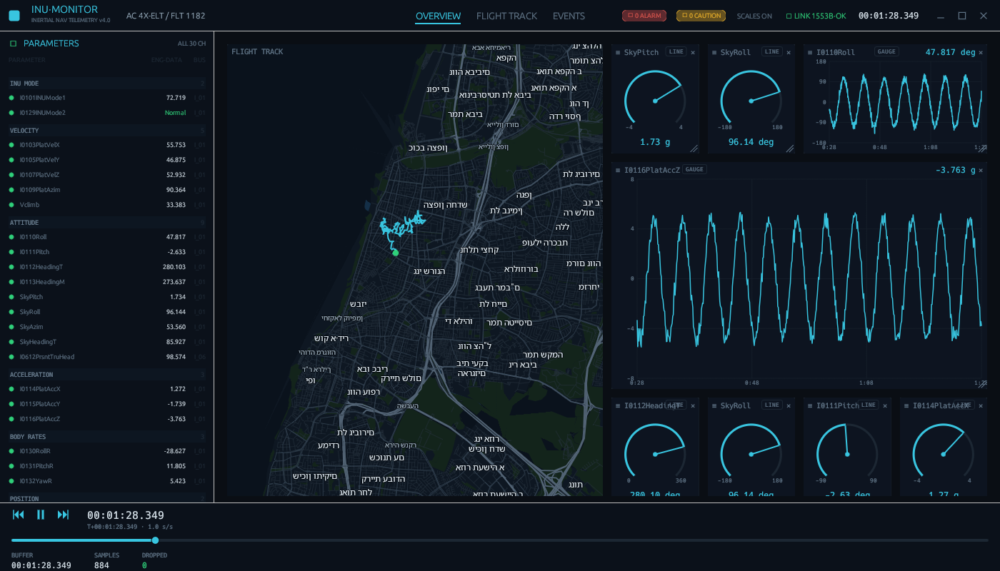

# rust-egui — egui/eframe immediate-mode variant

The **fourth** dashboard variant, and the lightweight end of the comparison: an
**immediate-mode** Rust UI on [`egui`](https://github.com/emilk/egui)/`eframe`
(glow / OpenGL backend). No HTML/CSS layout engine, no Vello/WGPU compute
renderer, no `system-fonts` database — the opposite of the Dioxus-native
(Blitz/Vello) variant.



## Why it exists

To answer "why does the native app eat ~530 MB when a C++ app was ~20 MB?" —
the memory was the **framework, not the language**. This variant, built on the
leanest common Rust GUI stack, lands at:

| | RAM | CPU | Processes |
|---|---|---|---|
| **rust-egui** | **~115 MB** | ~13% | 1 |

vs Dioxus-native ~530 MB, .NET/Avalonia-Skia ~279 MB, Tauri/WebView2 ~600+ MB
(all same ride, `RIDE_SPEED=1`, Release, 30 s warm-up — see the root README
table). ~4.6× lighter than Dioxus-native, ~2.4× lighter than .NET. Rust itself
is as lean as C++; the heavy variants pay for their rendering stack.

**The tradeoff is CPU (~13%)**, higher than the retained-mode stacks (.NET/Skia
~4–5%, Tauri ~3–4%). Immediate mode redraws the whole UI every frame at 30 Hz —
including re-projecting the entire MVT basemap (polygons, roads, labels) — while
MapLibre/Skia retain a GPU scene and redraw only on change. It buys low RAM by
spending CPU; caching the projected map geometry (re-tessellate only when the
view changes) would cut most of it.

The residual RAM gap to a ~20 MB C++/Dear-ImGui app is `eframe`'s bundled default
fonts + a bundled Noto Sans Hebrew (map labels) + the glow GL context + `std`. A
`softbuffer` + `tiny-skia` (CPU raster) or raw Direct2D build would close most of it.

## Scope — full INU parity

Everything drawn with `egui::Painter`, no widgets library:
- **Frameless** shell (`with_decorations(false)`): draggable top bar + vector
  minimize / maximize / close.
- Dark INU theme + monospace; top bar (logo mark, centered **clickable tabs**,
  compact ALARM/CAUTION pills, LINK, ride clock); bottom transport bar —
  play/pause + stacked clock/T+ · speed, a clickable seek slider, then a stacked
  BUFFER / SAMPLES / DROPPED row.
- Grouped parameter table (INU groups + counts, status dots, BUS column, enum
  decode with severity color — `Normal`/`Critical`). Rows are **drag sources**.
- **Interactive widget grid**: drag to move, resize grip (corner cursors +
  a dashed placeholder ghost while dragging/resizing, like the .NET `DropGhost`),
  click the badge to toggle LINE↔GAUGE, `×` to remove, and **drag a param row
  into the grid to add** a chart (backfilled with history).
- **Config-driven start layout** — [`../data/dashboard-layout.json`](../data/dashboard-layout.json),
  a shared 8-col grid descriptor next to `ride.db` (`$RIDE_LAYOUT` overrides the
  path); missing/invalid falls back to the computed seed (mirrors Tauri's
  `seedLayout`: map 4×4 + gauges + lines, first-fit packed).
- Radial gauges (arc + needle + scale) and strip charts (y/x axes, gridlines,
  **hover readout** of the value under the cursor).
- GPS track over a **fixed pan/zoom offline slippy map** — filled MVT basemap
  (sea, parks, landuse, road hierarchy, place/street labels) decoded from
  `israel.mbtiles` with `geozero`/`flate2`, projected in web-mercator and drawn
  to the egui painter (`basemap.rs`). **Drag to pan, scroll to zoom**; tiles are
  re-fetched + cached per view. No wgpu/WebView — runs in egui's glow/GL context.
  `FLIGHT TRACK` tab shows it full-screen. Labels use the Hebrew `name` (bundled
  **Noto Sans Hebrew**, like the Tauri MapLibre style); POI/shop labels and
  pure-numeric road refs are dropped so streets/places stand out.

Reuses `app_lib` (db / `replay::Pacer` / `metrics` / `tiles::MbTiles`)
in-process. Almost all of it is one `src/main.rs` (+ `basemap.rs`) —
immediate-mode fits a single file.

## Run

```bash
cd rust-egui
RIDE_DB=../data/ride_small.db RIDE_SPEED=1 cargo run --release
```

## Notes

- Repaints are capped to ~30 Hz (`request_repaint_after(33ms)`) — egui's default
  continuous mode free-runs at 60 Hz and pins a full core; the data is only
  10 Hz, so 30 Hz is smooth and cheap.
- `default-features = false` on `eframe` (glow only, no wgpu) keeps it light.
- Depending on `app_lib` pulls the Tauri dep graph into the build (compile
  weight only; no WebView is created at runtime).
- Prototype: pure-logic isn't split into unit-tested modules like rust-native —
  it's a single-file spike to establish the footprint floor.
